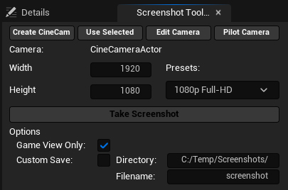
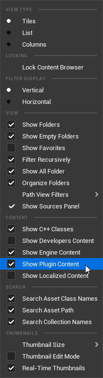
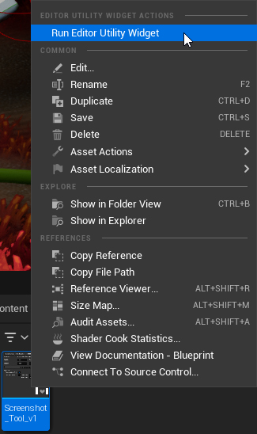
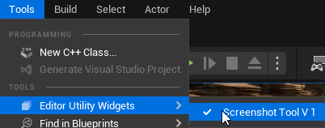

# Screenshot Tool V.0.1 - Blueprint Utility Widget
A prototype screenshot tool for Unreal Engine 5 to offer more control over the screenshot / render creation process.

This dockable Editor Widget offers improved control of the dimesions of your screenshot (including some presets) and the option to save screenshots to a chosen directory (other than the default folder in your project folder).

The tool was last tested in Unreal Engine 5.1.0 - will confirm functionality in later versions soon.

I plan on creating a new version with more features that is installable to the engine via the marketplace in the future but for now I'd like to provide this version for free to anyone who wants to try it out.

I'd appreciate any feedback, comments, ideas, suggestions etc. If you want to contact me, feel free to reach out via [Twitter](www.twitter.com/stu3dart) or via Email - Stu (at) Thundersteed (dot) co (dot) uk

---
## Installation Instructions

To install the screenshot tool, you need to:
1. Download the source from Github.com 
2. Add the **ScreenshotTool** folder to the **Plugins** directory of the project you want to use the tool in
3. Open the Content Browser in the Unreal Engine editor and Click Settings
4. Ensure **Show Plugin Content** and **Show Engine Content** are turned **ON**
   

6. Navigate to **Plugins > ScreenshotTool Content**
7. Right Click **Screenshot_Tool_v1** and select **Run Editor Utility Widget**

8. To dock the tool simply drag the tab onto another part of the Editor UI.
9. You can re-open the tool from the top toolbar by navigating to **Tools > Editor Utility Widgets > Screenshot Tool V 1**

